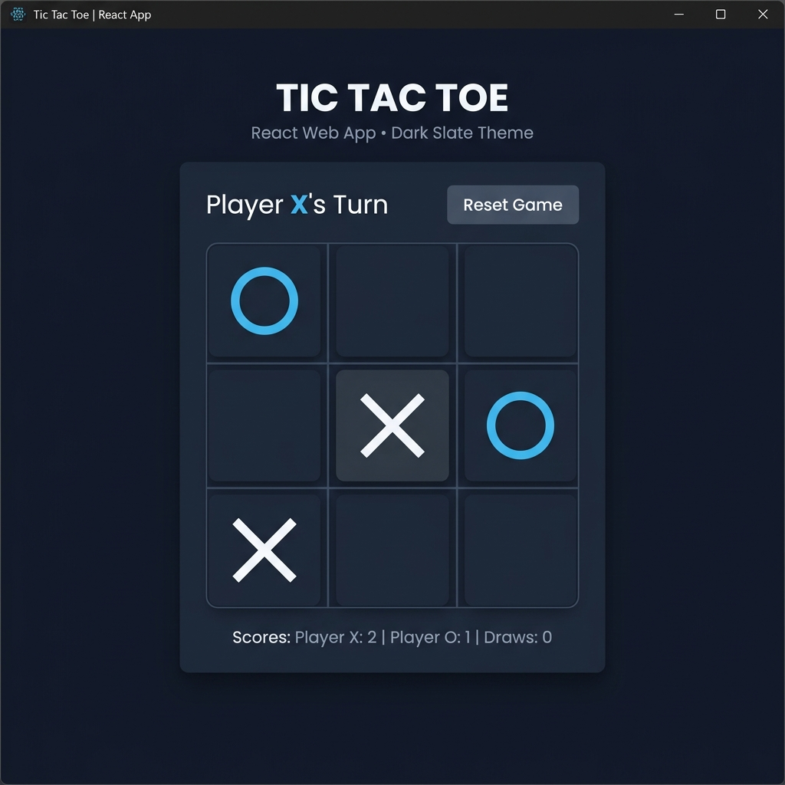
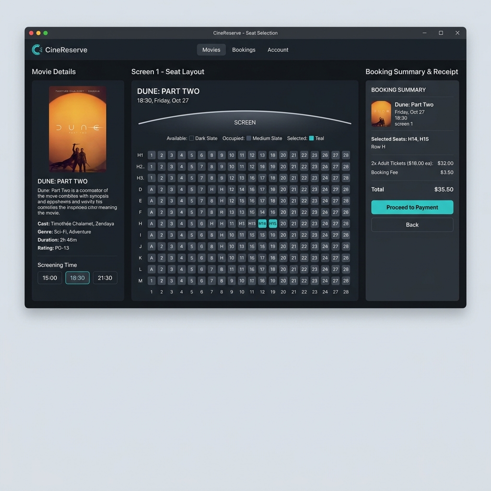
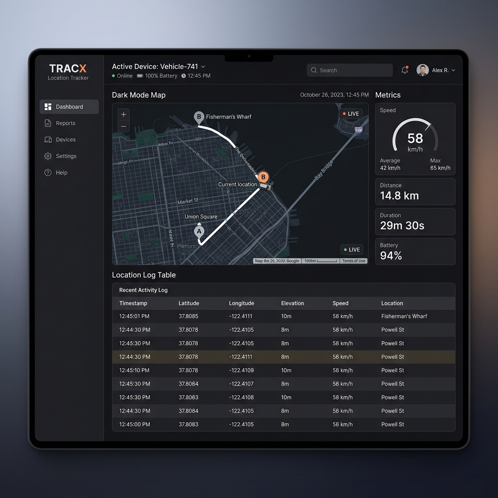

# Joseph Francis | Software Engineer Portfolio

<div align="center">
  
  [](#)
  [](#)
  [](#)
  [](#)
  [](#)
  [](#)

  <h4>
    A modern, professional personal portfolio showcasing projects, skills, and resume.
  </h4>

  <a href="https://joseph-francis42.github.io/portfolio/"><strong>Explore Live Site »</strong></a>
</div>

<br />

## 🌟 Highlights & Core Aesthetics

This portfolio is built to showcase standard engineering principles with a **bright, professional light theme** default and an elegant **dark slate theme** toggle.
*   **Zero Utility Overhead**: Crafted entirely using semantic React components and pure Vanilla CSS.
*   **Adaptive Responsive Layout**: Perfectly tailored for mobile, tablet, and widescreen monitors.
*   **Delicate Animations**: Ambient floating shapes in the hero background and interactive skill proficiency meters.

---

## 🛠️ Important Skills

*   **Java & Swing**: Desktop application engineering, object-oriented design, and interactive desktop GUI interfaces.
*   **Python**: Custom automation scripts, geocoding API integrations, data processing, and backends.
*   **C Programming**: Low-level systems programming, algorithms, data structures, and memory safety.
*   **HTML5 & CSS3**: Responsive flexbox and grid layouts, modern typography, custom properties, and transitions.
*   **SQL & Databases**: Relational database schemas, query optimization, joins, and database integrations.

---

## 📂 Highlighted Projects

### 1. React Tic Tac Toe
An interactive, browser-based version of the classic game built with React.js. Features state management with move history (time travel), custom player names, winning line highlights, and a clean minimalist design.

<div align="center">
  
</div>

### 2. Movie Booking System
A comprehensive seat reservation and ticketing desktop client built using Java Swing and backend SQL databases. Supports real-time ticket billing, seat grids, showtime schedules, and receipt generation.

<div align="center">
  
</div>

### 3. Location Tracker
A geographic mapping utility developed in Python. Queries coordinates using IP/GPS APIs, visualizes route histories, and logs device coordinates onto map interfaces.

<div align="center">
  
</div>

---

## 🚀 Setup & Local Execution

Get a copy of the project running locally by following these steps:

### Prerequisites
*   Node.js (v18 or higher recommended)
*   npm (installed with Node)

### Installation
1.  Clone the repository:
    ```bash
    git clone https://github.com/Joseph-Francis42/portfolio.git
    ```
2.  Navigate to the project folder:
    ```bash
    cd portfolio
    ```
3.  Install dependencies:
    ```bash
    npm install
    ```
4.  Start the development server:
    ```bash
    npm run dev
    ```
5.  Open [http://localhost:5173](http://localhost:5173) in your browser.
